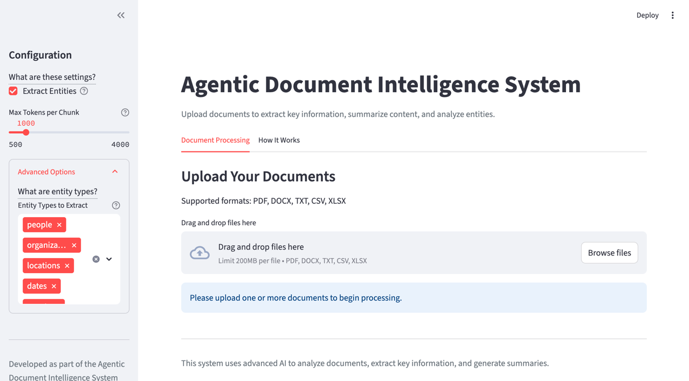

# Agentic Document Intelligence System



A complete tool that accepts documents (PDFs and other formats), extracts key information, summarizes the content, and displays everything in a Streamlit-based UI.

## Features

- **Document Loading**: Upload and process various document types (PDF, DOCX, TXT, CSV, XLSX)
- **Entity Extraction**: Identify people, organizations, locations, dates, events, and more
- **Document Summarization**: Generate concise summaries using a map-reduce approach
- **Interactive UI**: User-friendly Streamlit interface for document processing and result visualization

## System Architecture

The system follows an agentic graph-based architecture using LangGraph as shown in the [Architecture Diagram](architecture_diagram.md):

1. **Orchestrator Component**
   - Parses user requests
   - Coordinates document processing workflow
   - Routes tasks to specialized components

2. **Extraction Component**
   - Extracts entities, dates, sentiment, and relationships from documents
   - Identifies key topics and themes
   - Deduplicates entities and consolidates information

3. **Summarization Component**
   - Summarizes documents using a map-reduce approach
   - Handles large documents by breaking them into manageable chunks
   - Consolidates partial summaries into a final summary

For a detailed architecture diagram and component descriptions, see [Architecture Diagram](architecture_diagram.md).

## Installation

### Prerequisites

- Python 3.8+
- pip

### Setup

1. Clone the repository:
   ```bash
   git clone https://github.com/yourusername/Agentic_Summarization.git
   cd Agentic_Summarization
   ```

2. Create a virtual environment:
   ```bash
   python -m venv venv
   source venv/bin/activate  # On Windows: venv\Scripts\activate
   ```

3. Install dependencies:
   ```bash
   pip install -r requirements.txt
   ```

4. Set up environment variables:
   - Create a `.env` file in the project root
   - Add your API keys and configuration:
     ```
     OPENAI_API_KEY=your_openai_api_key
     LLM_SERVICE_TYPE=openai  # or azure_openai, gemini, aws
     ```

## Usage

1. Start the Streamlit app:
   ```bash
   streamlit run app.py
   ```

2. Open your browser and navigate to the URL shown in the terminal (typically http://localhost:8501)

3. Upload documents and configure processing options in the sidebar

4. Click "Process Documents" to start the analysis

5. View the results, including summaries and extracted entities

## API Usage

You can also use the system programmatically:

```python
import asyncio
from domains.workflows.routes import document_summarize_orchestrator

# Process a document
result = asyncio.run(document_summarize_orchestrator(
    file_paths="path/to/document.pdf",
    extract_entities=True,
    token_max=1000
))

# Access the results for a single document
if result.get("status") == "success":
    summary = result.get("summary")
    entities = result.get("entities")

# Or for multiple documents
if result.get("status") == "success" and "results" in result:
    for doc_result in result["results"]:
        doc_summary = doc_result.get("summary")
        doc_entities = doc_result.get("entities")
```

## Project Structure

- `domains/`: Core functionality modules
  - `doc_loader/`: Document loading and processing
    - `routes.py`: Document loading API
    - `utils.py`: Document processing utilities
  - `workflows/`: Orchestration and processing components
    - `graph.py`: LangGraph implementation for document processing
    - `models.py`: Data models for document processing
    - `prompt.py`: Prompt templates for LLM interactions
    - `routes.py`: API endpoints for document processing
    - `tools.py`: Utility tools for document processing
  - `utils.py`: Shared utility functions
  - `settings.py`: Configuration settings
- `app.py`: Streamlit UI
- `requirements.txt`: Project dependencies

## Use Case Examples

1. **Research Document Analysis**
   - Analyze academic papers to extract main contributions and key metrics
   - Summarize research findings and identify important dates
   - Extract key people, organizations, and technical terms

2. **Resume and CV Processing**
   - Extract candidate information, skills, and experience
   - Summarize professional background and key qualifications
   - Identify education history and employment dates

3. **Business Document Analysis**
   - Process contracts and agreements to extract key terms and entities
   - Summarize reports and identify key metrics and findings
   - Extract sentiment and key topics from customer feedback

## Contributing

Contributions are welcome! Please feel free to submit a Pull Request.

## License

This project is licensed under the MIT License - see the LICENSE file for details.
